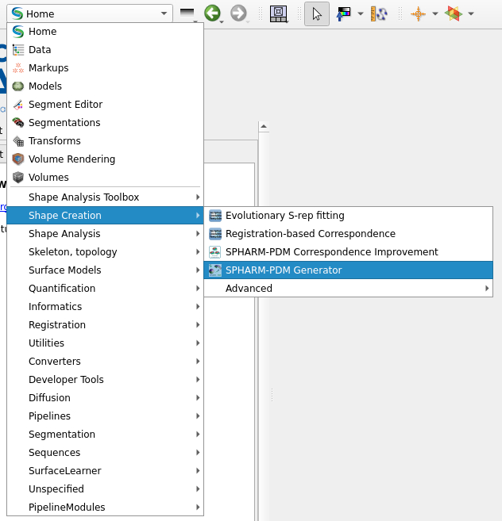

Data Preparation and Shape Creation
================

Overview
--------

This page describes how to prepare and validate input data used by SlicerSalt.

Instructions
-----------------------

Firstly, for good practice, create separate folders for each shape, as well as separate input/output directories.

.. code-block:: console
   mkdir AmygdalaLeft AmygdalaRight CaudateLeft CaudateRight GPLeft GPRight HippocampusLeft HippocampusRight PutamenLeft PutamenRight ThalamusLeft ThalamusRight
   for d in AmygdalaLeft AmygdalaRight CaudateLeft CaudateRight GPLeft GPRight HippocampusLeft HippocampusRight PutamenLeft PutamenRight ThalamusLeft ThalamusRight; do mkdir -p "$d"/{input/{model,volume,defunct},output}; done

In SlicerSalt, select the Shape Creation -> SPHARM-PDM Generator module.

Next, configure the input/output paths and parameters as needed under `Group Project IO`. Select `Run ShapeAnalysisModule` to start the process.

Next steps
----------

After preparing data, follow the Shape Population Viewer guide to verify the correctness of the SPHARM-PDM outputs.