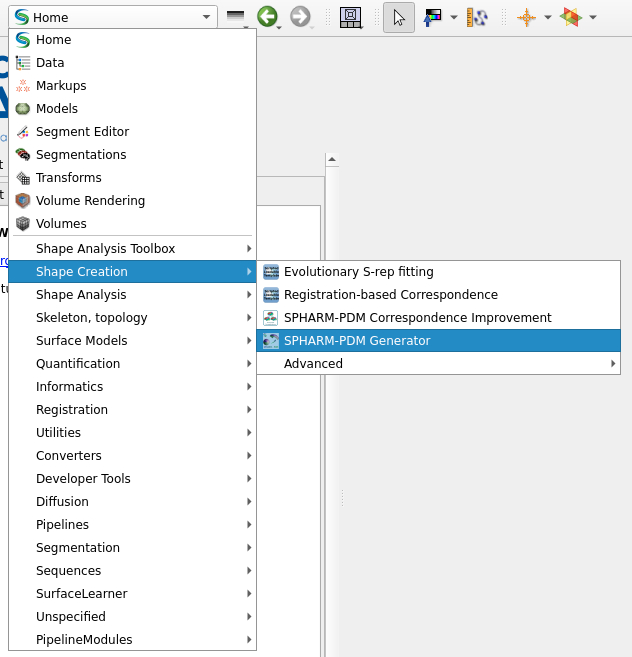

Surface Model Creation
==============

This page describes how to create shapes in SlicerSalt using the SPHARM-PDM
generator.

Instructions
------------

In SlicerSalt, select the Shape Creation -> SPHARM-PDM Generator module.

Next, configure the input/output paths and parameters as needed under
`Group Project IO`. Select `Run ShapeAnalysisModule` to start the process.

Error Handling
----------------

There can be a specific error that occurs during the SPHARM-PDM generation process. This is an example of the error:

`
itk::BinaryMask3DEqualAreaParametricMeshSourceException (0x558e78680400)
Location: "Unknown"
File: /work/Stable/SSALT-0-build/SPHARM-PDM/Libraries/Shape/Algorithms/BinaryMask3DEqualAreaParametricMeshSource.txx
Line: 183
Description: Warning: Euler equation not satisfied. Euler Number : 12752 - 12756 = -4
`

To resolve this issue, we removed the problematic labelmap file from your input dataset and rerun the SPHARM-PDM Generator. This error typically indicates that the input shape has topological issues that prevent successful processing.
We moved the problematic file to a separate folder for further inspection later. In order to fix this issue manually, there needs manual adjustment of the subcortical segmentation.
Then restart the SPHARM-PDM generation process.

Next steps
----------

After running the generator, verify the outputs and proceed to the Shape
Population Viewer guide to inspect the SPHARM-PDM results.
