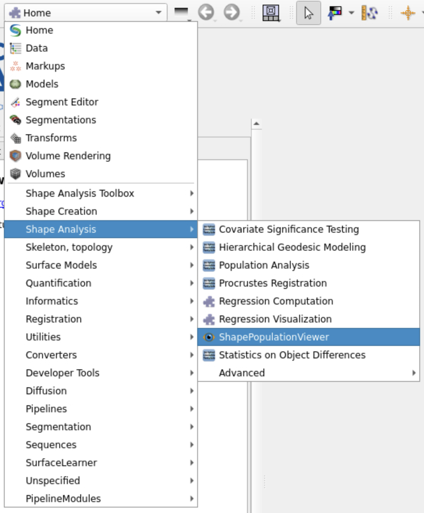
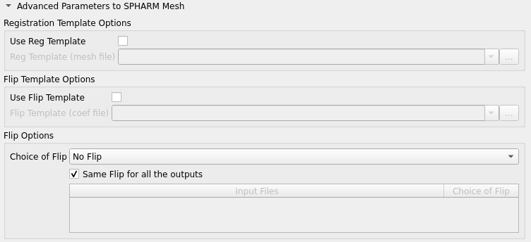

Shape Population
================

Overview
--------

This page describes how to use the Shape Population Viewer module in SlicerSalt to verify the correctness of the SPHARM-PDM outputs.

Instructions
---------------------------

First we need to prepare the outputs from the `SPHARM-PDM Generator` module. Once you have the output files, you can use the Shape Population Viewer to visualize and validate the populated shapes.
However, simply loading the files would take a while, so we can divide up the `*SPHARM.vtk` files into smaller chunks.

First ensure that we are in the `Shape/output` directory. This script below will create three folders `SP1`, `SP2`, and `SP3`, and distribute the `*SPHARM.vtk` files into SymLinks and evenly among them.

.. code-block:: console

   mkdir -p SP1 SP2 SP3 && i=0; for f in Step3_ParaToSPHARMMesh/*SPHARM.vtk; do ((i++)); n=$(( (i-1)%3 + 1 )); cp "$f" SP$n/; done

Verification
---------------------

In SlicerSalt, select the Shape Analysis -> ShapePopulationViewer module.

Next, we can open the specific `SP*` directory by clicking on the `Open Directory` button. After loading, you should see many shapes displayed on the 3D view.
To validate the shapes, we need to make sure each shape is oriented in the right direction. There can be many discrepancies, which can be fixed by a variety of transformations in the SPHARM-PDM Generator module.

Here are some common issues to look for:

- Rotated shapes in paraPhi view:
   .. image:: ../_static/ex1.png
      :alt: Rotated shapes in paraPhi view
   -- Flip on xz plane in SPHARM-PDM Generator module.
- Mirrored shapes in paraTheta view:
   .. image:: ../_static/ex2.png
      :alt: Flipped shapes in paraTheta view
   -- Flip on y plane in SPHARM-PDM Generator module.

We then need to rerun the SPHARM-PDM Generator module with the appropriate transformations to correct these issues.

Firstly, in `Shape/output/Step3_ParaToSPHARMMesh`, delete the existing files for the corresponding trial.

Open the `Advanced Parameters to SPHARM Mesh` section and untick the `Same Flip for all the outputs` option.

Then, for each shape that needs correction, select the shape from the dropdown and apply the necessary transformations.

Next steps
----------

TBD.